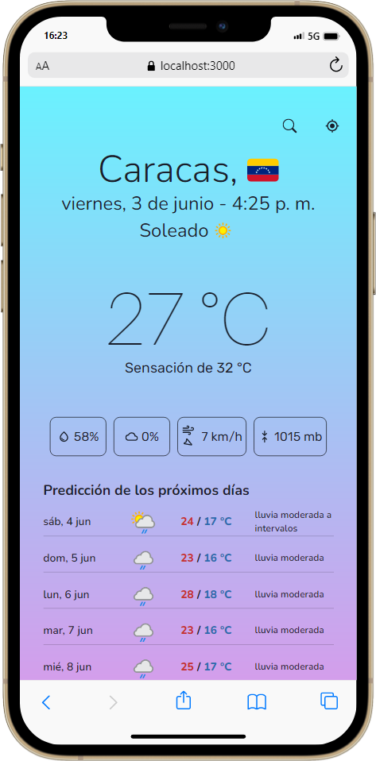
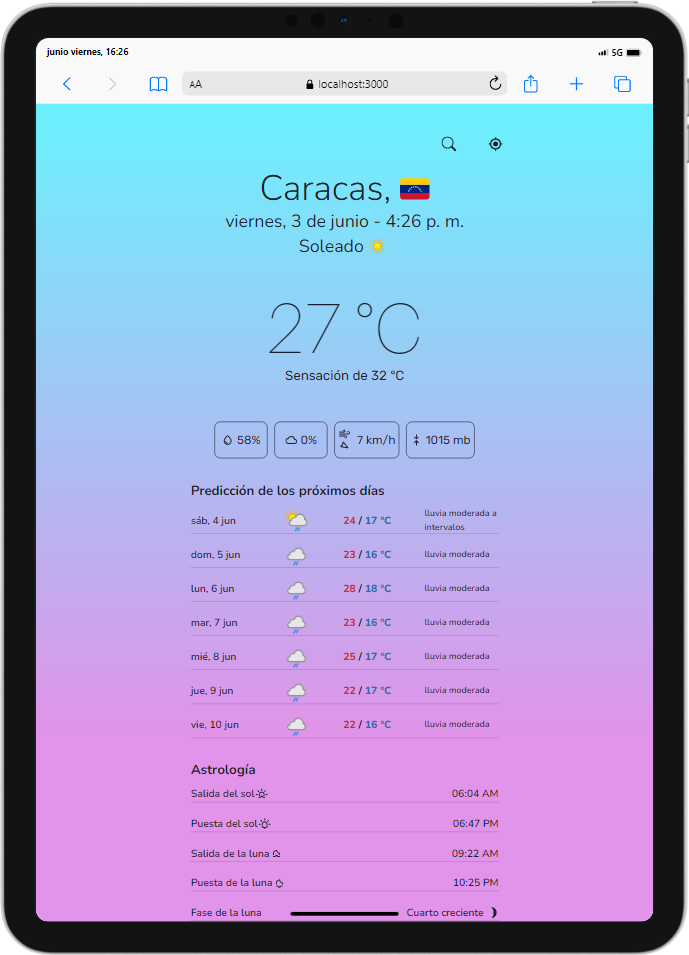
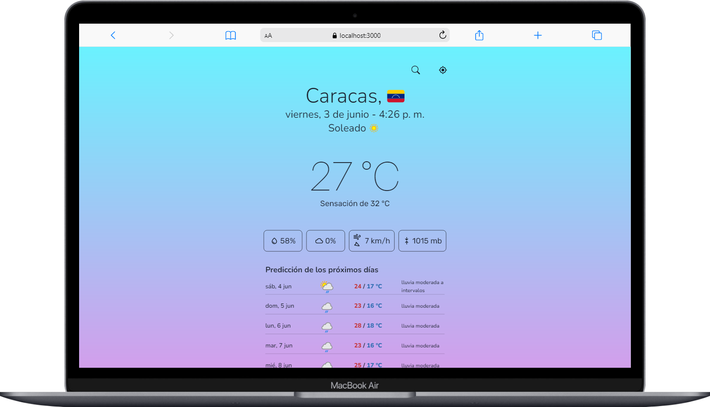

## Climatic
Monorepo project that shows the current weather data and weather forecast for next 7 days. <br />
Created from scratch to participate in a 14-days hackathon hosted by [midudev](https://www.github.com/midudev).

## Hackathon
- The hackathon goal was build a weather web app (*mobile-first* or *mobile-only*) in two weeks using a weather API from [RapidAPI](https://rapidapi.com).
- It was announced at **[2022/05/19](https://www.twitch.tv/videos/1488279878)**.
- There was 38 project entries. The first 19 were reviewed at **[2022/06/02](https://www.twitch.tv/videos/1315914232)**. The last 19 were reviewed at **2022/06/07**. The winner was choosed at **2022/06/14**.
- Climatic was picked as the 4th best project in the first review, but was not elegible for any prize.
- The last commit before the project revision can be found [here](https://github.com/marsidev/climatic/tree/5d42530432663b8d30fe57047ee51e742d508851).
- The winner project can be found [here](https://github.com/ikurotime/GeoWeather).

## 🚀 Preview
App preview before deadline and project review: <br />
<div style="display:flex; flex-direction:column; text-align:center; align-items:center; gap:1em;">
  <div style="display:flex; gap:1em; justify-content:center;">
    
    
  </div>
  
</div>

> Screenshots provided by [webmobilefirst](https://www.webmobilefirst.com/en/).

### Links
- [Demo](https://clima-tic.herokuapp.com "Climatic deployed on Heroku") <br />
- [Mirror 1](https://climatic.onrender.com "Climatic deployed on Render") <br />
- [Mirror 2](https://climatic-production.up.railway.app "Climatic deployed on Railway")

## 🛠️ Technologies
- [pnpm](https://github.com/pnpm/pnpm)
- [typescript](https://github.com/microsoft/TypeScript)
- [fastify](https://github.com/fastify/fastify)
- [react](https://github.com/facebook/react)
- [vite](https://github.com/vitejs/vite)
- [chakra-ui](https://github.com/chakra-ui/chakra-ui)
- [zustand](https://github.com/pmndrs/zustand)
- [swr](https://github.com/vercel/swr)
- [react-router](https://reactrouter.com)
- [isomorphic-fetch](https://github.com/matthew-andrews/isomorphic-fetch)
- [node-cache](https://github.com/node-cache/node-cache)
- [playwright](https://github.com/microsoft/playwright)
- [vitest](https://github.com/vitest-dev/vitest)
- [react-testing-library](https://github.com/testing-library/react-testing-library)
- [msw](https://github.com/mswjs/msw)
- [eslint](https://github.com/eslint/eslint)

## ✨ Getting Started

### Clone the project using one of these ways:
1. [Fork](https://github.com/marsidev/climatic/fork) the repository

2. Clone the repository locally
```bash
git clone https://github.com/marsidev/climatic
cd climatic
```

### Install dependencies
```bash
pnpm install
```

### Set environment variables
Create an `.env` file in the root of your project and add the following values:
```bash
RAPIDAPI_KEY=
APP_URL=
```

> To get your `RAPIDAPI_KEY` you need to subscribe to [weatherapi](https://rapidapi.com/weatherapi/api/weatherapi-com/). <br />
`APP_URL` is optional. If present, will be used as origin url for [cors](https://github.com/fastify/fastify-cors).

### Run the project
```bash
pnpm dev
```

In order to use the geolocation API, you need to run the client server with `https` protocol. This can achieved by running:
```bash
pnpm dev:https
```

Open [http://localhost:3000](http://localhost:3000) or [https://localhost:3000](https://localhost:3000) with your browser to see the result.

> If you are running in *https* mode, you will get a warning in your browser about non-secure connection.

## 🤝 Contributing
Contributions, issues and feature requests are welcome!
Feel free to check [issues page](https://github.com/marsidev/climatic/issues).
